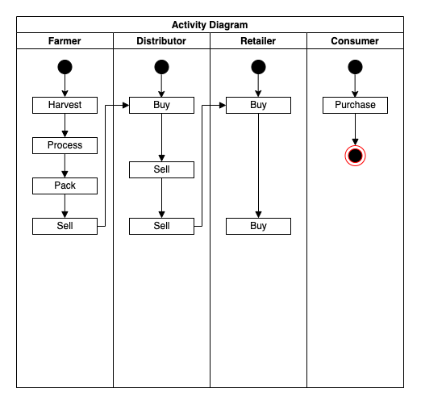
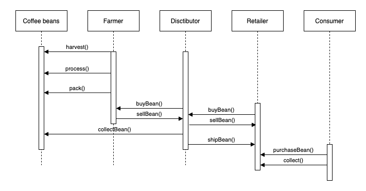
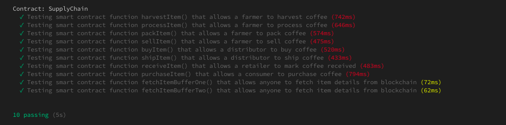

# Project Requirements

## A project write-up

### Contract

* truffle migrate --network rinkeby
```bash
Using network 'rinkeby'.

Running migration: 1_initial_migration.js
  Deploying Migrations...
  ... 0x0c7e73a57950359213f673e1923c5d9c423ae9325bb61e4c4e144ec210d6b6b7
  Migrations: 0x853d106018adcaf04aa43ef81e7ac0ad783c3bb2
Saving successful migration to network...
  ... 0x81f9379404a40324da9a9be7abefecd49793d68af4233b07ce3842a2212266e2
Saving artifacts...
Running migration: 2_deploy_contracts.js
  Deploying FarmerRole...
  ... 0x68101d3398f71f3dbdf6b698c853aa7cf2e9c079421c53affb94e06c1331492a
  FarmerRole: 0x2e3f882b8d9a78d2cb9ddc92d1ca8340330f3c71
  Deploying DistributorRole...
  ... 0x7341d07e2c01909b230c4130dcac284db5ada1b961344b93bf52a783448f67ee
  DistributorRole: 0x5c971892dfe96a09856bc10efbb864241949594a
  Deploying RetailerRole...
  ... 0xd5e609bff4b4d59d55cac8686d876bb9841b458b207a0c99bf82b52c16641538
  RetailerRole: 0x462254f32efbd3bfaf9fe2dbda6c71f1be0e4ca8
  Deploying ConsumerRole...
  ... 0x572158b296c83fa771b7f3f0367f0f2670098d9a3f11f3e51dae05226e4ec86c
  ConsumerRole: 0xda66615c16f71606715e1397e565690aafd37540
  Deploying SupplyChain...
  ... 0x298b553e1f933e584c6b567f7001030027d2606f041378471240c0ec7aa2643e
  SupplyChain: 0x1280e15e4535823253b4519a01d1cd63060ce488
Saving successful migration to network...
  ... 0x55721733733496d060737c798e1adc72328380e406c0d45d84a0c04bc328f3d9
Saving artifacts...
```
* [Contract Address](https://rinkeby.etherscan.io/address/0x1280e15e4535823253b4519a01d1cd63060ce488)
* [Add Farmer Transaction](https://rinkeby.etherscan.io/tx/0xfd6699a1ea76667aae0d3244e5164f1b0aca627d975f720f15790edaf229f136)
### Program version numbers

* Solidity 0.4.24
* Truffle 4.1.14
* node 12.13.0
* npm 6.12.0

### Library used
* ganache-cli": "^6.12.2"
* truffle-hdwallet-provider": "^1.0.17"

## UML Diagram
### Activity


### Sequence


# Test Result



---------- Below are original project example README.md -----------

# Supply chain & data auditing

This repository containts an Ethereum DApp that demonstrates a Supply Chain flow between a Seller and Buyer. The user story is similar to any commonly used supply chain process. A Seller can add items to the inventory system stored in the blockchain. A Buyer can purchase such items from the inventory system. Additionally a Seller can mark an item as Shipped, and similarly a Buyer can mark an item as Received.

The DApp User Interface when running should look like...


## Getting Started

These instructions will get you a copy of the project up and running on your local machine for development and testing purposes. See deployment for notes on how to deploy the project on a live system.

### Prerequisites

Please make sure you've already installed ganache-cli, Truffle and enabled MetaMask extension in your browser.

```
Give examples (to be clarified)
```

### Installing

> The starter code is written for **Solidity v0.4.24**. At the time of writing, the current Truffle v5 comes with Solidity v0.5 that requires function *mutability* and *visibility* to be specified (please refer to Solidity [documentation](https://docs.soliditylang.org/en/v0.5.0/050-breaking-changes.html) for more details). To use this starter code, please run `npm i -g truffle@4.1.14` to install Truffle v4 with Solidity v0.4.24. 

A step by step series of examples that tell you have to get a development env running

Clone this repository:

```
git clone https://github.com/udacity/nd1309/tree/master/course-5/project-6
```

Change directory to ```project-6``` folder and install all requisite npm packages (as listed in ```package.json```):

```
cd project-6
npm install
```

Launch Ganache:

```
ganache-cli -m "spirit supply whale amount human item harsh scare congress discover talent hamster"
```

Your terminal should look something like this:


In a separate terminal window, Compile smart contracts:

```
truffle compile
```

Your terminal should look something like this:


This will create the smart contract artifacts in folder ```build\contracts```.

Migrate smart contracts to the locally running blockchain, ganache-cli:

```
truffle migrate
```

Your terminal should look something like this:


Test smart contracts:

```
truffle test
```

All 10 tests should pass.


In a separate terminal window, launch the DApp:

```
npm run dev
```

## Built With

* [Ethereum](https://www.ethereum.org/) - Ethereum is a decentralized platform that runs smart contracts
* [IPFS](https://ipfs.io/) - IPFS is the Distributed Web | A peer-to-peer hypermedia protocol
to make the web faster, safer, and more open.
* [Truffle Framework](http://truffleframework.com/) - Truffle is the most popular development framework for Ethereum with a mission to make your life a whole lot easier.


## Authors

See also the list of [contributors](https://github.com/your/project/contributors.md) who participated in this project.

## Acknowledgments

* Solidity
* Ganache-cli
* Truffle
* IPFS
